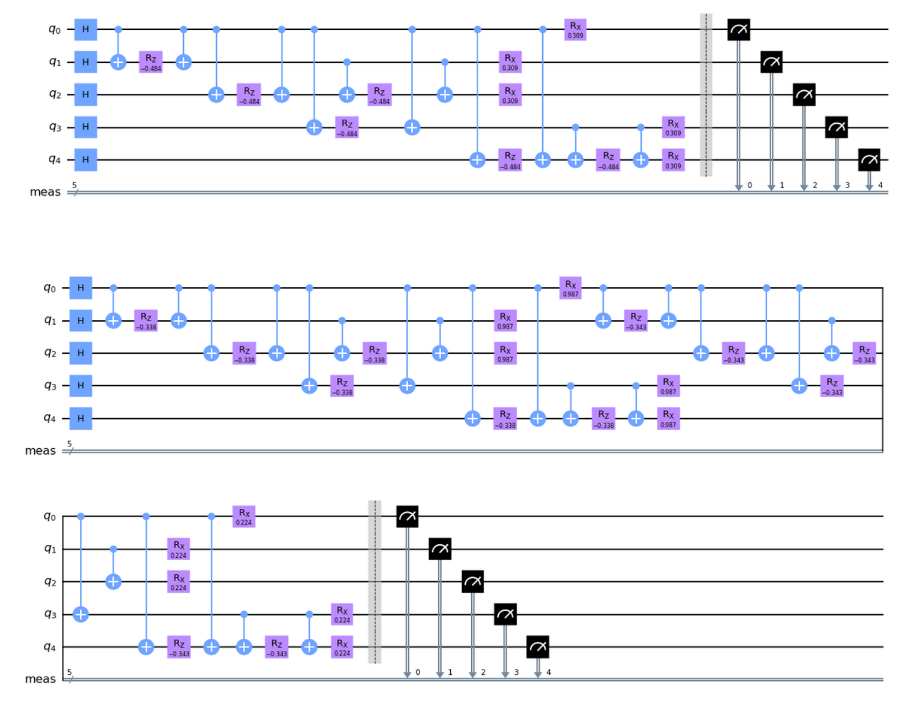

# QAOA for the Max-Cut Problem ❄️ 

## Abstract
Quantum approximate optimization algorithms (QAOA) are a class of quantum algorithms applicable to combinatorial optimization problems. In this project, I
present a general overview of the process of adapting a problem to a QAOA-based approach. Then, I apply QAOA to the Max-Cut Problem for unweighted graphs, showing the process of developing the appropriate circuit in Qiskit and assessing the validity of my measurements.

## Takeaways
The final ansatz for a 5-node graph looks like this (although code is provided for graph of any number of nodes):

	

See the ipynb notebook for more implementation details, and my paper (the PDF file) for more details on the history and mathematical derivation of QAOA.
